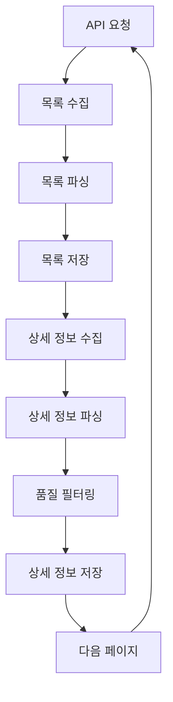

# 법률 용어 수집 시스템 기술 문서

## 개요

법률 용어 수집 시스템은 국가법령정보센터의 법령용어사전 API를 활용하여 전문적인 법률 용어 데이터를 수집하는 시스템입니다. 이 시스템은 목록 수집과 상세 정보 수집을 번갈아가면서 진행하여 효율적인 데이터 수집을 제공합니다.

## 시스템 아키텍처

### 핵심 컴포넌트

```
scripts/data_collection/law_open_api/legal_terms/
├── legal_term_collector.py          # 메인 수집 스크립트
├── cleanup_invalid_files.py        # 유효하지 않은 파일 정리
├── cleanup_empty_files.py          # 빈 파일 정리
└── config/
    └── legal_term_collection_config.yaml  # 설정 파일
```

### 데이터 흐름



## API 인터페이스

### 목록 조회 API

**엔드포인트**: `http://www.law.go.kr/DRF/lawService.do`

**파라미터**:
- `OC`: 사용자 이메일 ID (필수)
- `target`: 서비스 대상 (기본값: "lstrm")
- `type`: 출력 형태 ("JSON" 권장)
- `query`: 검색 쿼리 (선택사항)
- `page`: 페이지 번호 (기본값: 1)
- `display`: 페이지당 항목 수 (기본값: 100)

**응답 구조**:
```json
{
  "lstrm": {
    "totalCount": 15000,
    "items": [
      {
        "법령용어ID": "3945293",
        "법령용어명": "(Instrument Meterological Condition; IMC)",
        "법령용어상세검색": "/LSW/lsTrmInfoR.do?trmSeqs=3945293&mobile=",
        "사전구분코드": "011402",
        "법령용어상세링크": "/DRF/lawService.do?OC=test&target=lstrm&trmSeqs=3945293&mobile=&type=XML",
        "법령종류코드": 10102,
        "lstrm_id": 1
      }
    ]
  }
}
```

### 상세 조회 API

**엔드포인트**: `http://www.law.go.kr/DRF/lawService.do`

**파라미터**:
- `OC`: 사용자 이메일 ID (필수)
- `target`: 서비스 대상 (기본값: "lstrm")
- `type`: 출력 형태 ("JSON" 권장)
- `query`: 용어명 (필수)

**응답 구조**:
```json
{
  "법령용어일련번호": 4350393,
  "법령용어명_한글": "080착신과금사업자",
  "법령용어명_한자": "080착신과금사업자",
  "법령용어코드": 11402,
  "법령용어코드명": "법령정의사전",
  "출처": "시내전화서비스 등 번호이동성 시행에 관한 기준[과학기술정보통신부고시 제2023-40호, 2023.11.9., 일부개정]",
  "법령용어정의": "착신과금서비스를 제공하는 기간통신사업자를 말한다."
}
```

## 데이터 모델

### LegalTermListItem

```python
@dataclass
class LegalTermListItem:
    법령용어ID: str
    법령용어명: str
    법령용어상세검색: str
    사전구분코드: str
    법령용어상세링크: str
    법령종류코드: int
    lstrm_id: int
```

### LegalTermDetail

```python
@dataclass
class LegalTermDetail:
    법령용어일련번호: int
    법령용어명_한글: str
    법령용어명_한자: str
    법령용어코드: int
    법령용어코드명: str
    출처: str
    법령용어정의: str
```

## 핵심 기능

### 1. 번갈아가면서 수집 (collect_alternating)

목록 수집과 상세 정보 수집을 번갈아가면서 진행하는 메인 기능입니다.

```python
async def collect_alternating(self, start_page: int = 1, end_page: Optional[int] = None,
                            list_batch_size: int = 50, detail_batch_size: int = 10,
                            query: str = "", gana: str = "") -> None:
    """목록 수집과 상세 수집을 번갈아가면서 진행"""
```

**특징**:
- 페이지별로 목록 수집 → 상세 정보 수집 순서로 진행
- 중복 저장 방지
- 실시간 진행률 추적

### 2. 품질 필터링

수집된 데이터의 품질을 보장하기 위한 다단계 필터링 시스템입니다.

#### 1차 필터링: API 응답 레벨
```python
def _parse_term_detail_response(self, response: Dict[str, Any], term_name: str) -> Optional[LegalTermDetail]:
    # "일치하는 법령용어가 없습니다" 응답 필터링
    if "Law" in response and "일치하는 법령용어가 없습니다" in str(response["Law"]):
        logger.warning(f"일치하는 법령용어가 없음: {term_name}")
        return None
```

#### 2차 필터링: 객체 검증 레벨
```python
if hasattr(detail, '법령용어일련번호') and hasattr(detail, '법령용어명_한글'):
    # 유효한 데이터인 경우에만 저장
```

#### 3차 필터링: 저장 레벨
```python
def _save_to_file(self, data: Any, filename: str, batch_number: int, page_info: str = ""):
    # 빈 배열이나 유효하지 않은 데이터 체크
    if isinstance(data, list) and len(data) == 0:
        logger.warning("빈 배열은 저장하지 않습니다.")
        return
```

### 3. JSON 직렬화 처리

`LegalTermDetail` 객체의 JSON 직렬화 문제를 해결하기 위한 처리 로직입니다.

```python
# 객체를 딕셔너리로 변환
from dataclasses import asdict
detail_dict = asdict(detail)
self._save_to_file([detail_dict], "legal_term_detail", i, f"page{current_page}_{safe_term_name}")
```

### 4. 중복 저장 방지

목록 파일의 중복 저장을 방지하는 로직입니다.

```python
# collect_alternating에서 직접 목록 수집 (collect_term_list 호출하지 않음)
response = await self.get_term_list(current_page, query=query, gana=gana)
items, total_count = self._parse_term_list_response(response)
self._save_to_file([asdict(item) for item in items], "legal_term_list", current_page, f"page{current_page}")
```

## 설정 관리

### 환경 변수

```bash
# .env 파일
LAW_OPEN_API_OC=your_email_id
```

### 설정 파일 (legal_term_collection_config.yaml)

```yaml
api:
  base_url: "http://www.law.go.kr/DRF/lawService.do"
  rate_limit_delay: 1.0
  max_retries: 3
  timeout: 30

collection:
  batch_size: 50
  detail_delay: 1.0
  save_every_page: false

logging:
  level: INFO
  file: "logs/legal_term_collection.log"
```

## 오류 처리

### 일반적인 오류

1. **API 응답 실패**
   ```
   일치하는 법령용어가 없음: (용어명)
   ```
   - 원인: 해당 용어가 법령용어사전에 존재하지 않음
   - 처리: 정상적인 필터링 결과로 처리

2. **JSON 직렬화 오류**
   ```
   Object of type LegalTermDetail is not JSON serializable
   ```
   - 원인: dataclass 객체를 직접 JSON으로 직렬화 시도
   - 해결: `asdict()` 함수로 딕셔너리 변환 후 직렬화

3. **변수 스코프 오류**
   ```
   cannot access local variable 'asdict' where it is not associated with a value
   ```
   - 원인: `asdict` import가 함수 내부에서만 유효
   - 해결: 각 사용 위치에서 명시적으로 import

### 재시도 로직

```python
async def _make_request_with_retry(self, url: str, params: Dict[str, Any], headers: Dict[str, str]) -> Optional[str]:
    for attempt in range(self.max_retries):
        try:
            async with self.session.get(url, params=params, headers=headers) as response:
                if response.status == 200:
                    return await response.text()
        except Exception as e:
            logger.warning(f"요청 실패 (시도 {attempt + 1}/{self.max_retries}): {e}")
            if attempt < self.max_retries - 1:
                await asyncio.sleep(2 ** attempt)  # 지수 백오프
    return None
```

## 성능 최적화

### 메모리 관리

- 배치 단위로 데이터 처리
- 불필요한 변수 즉시 삭제
- 스트리밍 방식으로 대용량 파일 처리

### API 요청 최적화

- 요청 간격 조정 (기본 1초)
- 재시도 로직 (최대 3회)
- 타임아웃 설정 (30초)

### 파일 I/O 최적화

- 페이지별 즉시 저장
- 중복 저장 방지
- 압축 저장 옵션

## 모니터링

### 진행률 추적

```python
def get_collection_stats(self) -> Dict[str, Any]:
    """수집 통계 조회"""
    return {
        "total_terms": list_count,
        "collected_details": detail_count,
        "list_files": len(list_files),
        "detail_files": len(detail_files),
        "progress": asdict(self.progress)
    }
```

### 로깅

```python
# 실시간 로그 확인
tail -f logs/legal_term_collection.log

# 특정 레벨 로그 확인
grep "ERROR" logs/legal_term_collection.log
```

## 확장성

### 새로운 데이터 소스 추가

1. 새로운 API 엔드포인트 추가
2. 파싱 로직 구현
3. 데이터 모델 정의
4. 필터링 로직 추가

### 배치 처리 확장

1. 병렬 처리 지원
2. 분산 수집 시스템
3. 실시간 스트리밍 처리

## 보안 고려사항

### API 키 관리

- 환경 변수를 통한 API 키 관리
- 로그에서 API 키 제외
- 키 로테이션 지원

### 데이터 검증

- 입력 데이터 검증
- 출력 데이터 검증
- 무결성 체크

## 테스트

### 단위 테스트

```python
def test_parse_term_detail_response():
    """상세 정보 파싱 테스트"""
    response = {"법령용어일련번호": 123, "법령용어명_한글": "테스트"}
    result = collector._parse_term_detail_response(response, "테스트")
    assert result is not None
    assert result.법령용어일련번호 == 123
```

### 통합 테스트

```python
def test_collect_alternating():
    """번갈아가면서 수집 테스트"""
    collector = LegalTermCollector()
    await collector.collect_alternating(start_page=1, end_page=1)
    # 결과 검증
```

## 배포

### Docker 지원

```dockerfile
FROM python:3.9-slim

WORKDIR /app
COPY requirements.txt .
RUN pip install -r requirements.txt

COPY scripts/ ./scripts/
COPY config/ ./config/

CMD ["python", "scripts/data_collection/law_open_api/legal_terms/legal_term_collector.py"]
```

### 환경별 설정

- 개발 환경: 디버그 로깅, 작은 배치 크기
- 스테이징 환경: 중간 배치 크기, 제한된 수집량
- 프로덕션 환경: 최적화된 설정, 전체 수집

## 문제 해결 가이드

### 자주 발생하는 문제

1. **메모리 부족**
   - 배치 크기 줄이기
   - 시스템 메모리 확인

2. **API 응답 지연**
   - 타임아웃 값 증가
   - 네트워크 상태 확인

3. **데이터 형식 오류**
   - API 응답 구조 확인
   - 파싱 로직 점검

### 지원

문제가 지속되면 다음을 확인하세요:

1. 로그 파일 검토
2. 환경변수 설정 확인
3. API 키 유효성 확인
4. 네트워크 연결 상태 확인

---

**LawFirmAI 개발팀**  
*최종 업데이트: 2025.10.24*
