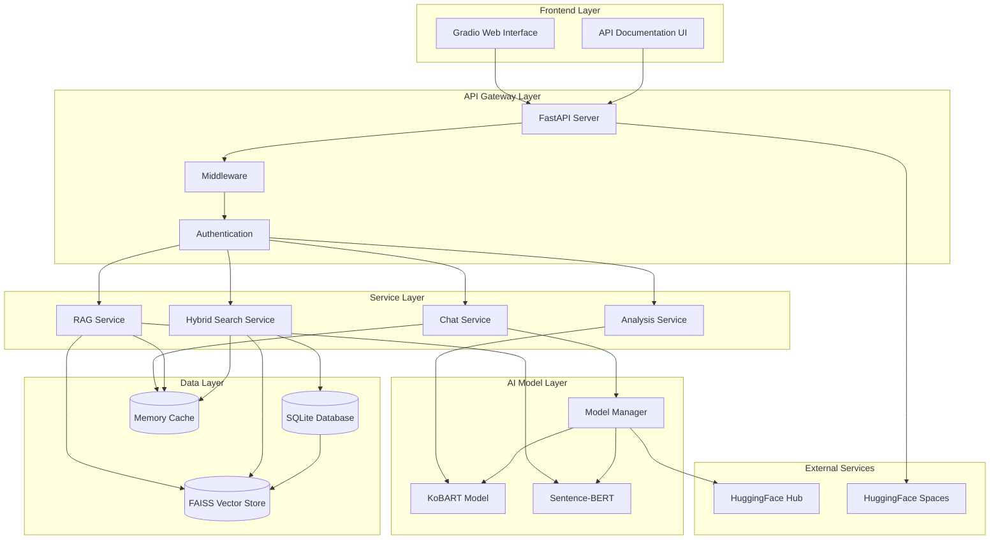
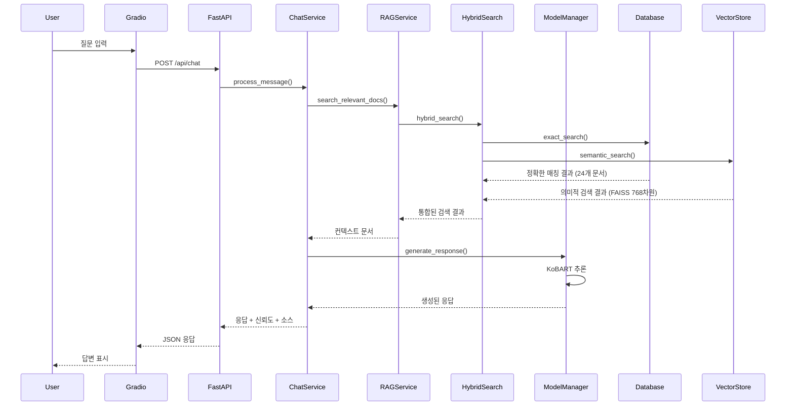
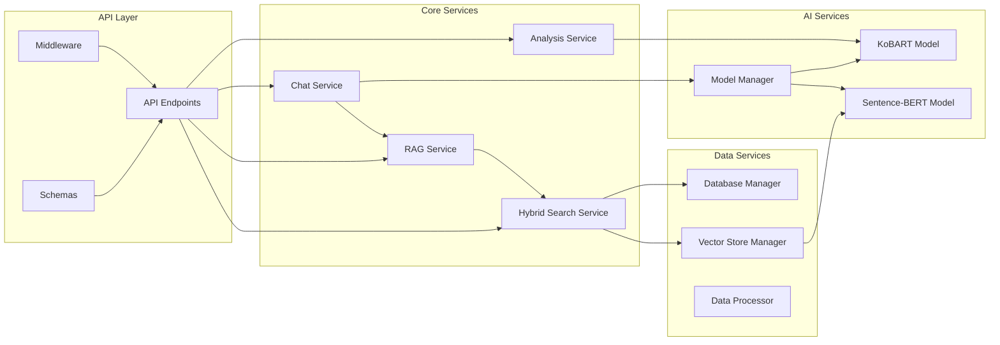
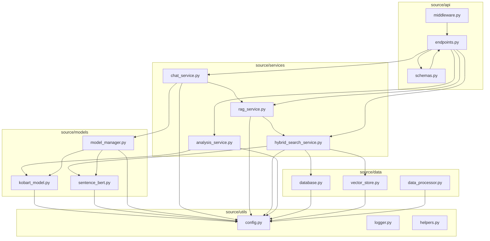
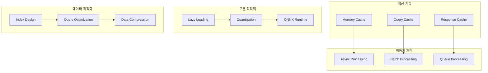

# LawFirmAI 시스템 아키텍처

## 전체 시스템 아키텍처

```mermaid
graph TB
    subgraph "Frontend Layer"
        UI[Gradio Web Interface]
        API_UI[API Documentation UI]
    end
    
    subgraph "API Gateway Layer"
        FASTAPI[FastAPI Server]
        MW[Middleware]
        AUTH[Authentication]
    end
    
    subgraph "Service Layer"
        CHAT[Chat Service]
        RAG[RAG Service]
        HYBRID[Hybrid Search Service]
        ANALYSIS[Analysis Service]
    end
    
    subgraph "AI Model Layer"
        KOBART[KoBART Model]
        SENTBERT[Sentence-BERT]
        MODEL_MGR[Model Manager]
    end
    
    subgraph "Data Layer"
        SQLITE[(SQLite Database)]
        FAISS[(FAISS Vector Store)]
        CACHE[(Memory Cache)]
    end
    
    subgraph "External Services"
        HF[HuggingFace Hub]
        SPACES[HuggingFace Spaces]
    end
    
    UI --> FASTAPI
    API_UI --> FASTAPI
    FASTAPI --> MW
    MW --> AUTH
    AUTH --> CHAT
    AUTH --> RAG
    AUTH --> HYBRID
    AUTH --> ANALYSIS
    
    CHAT --> MODEL_MGR
    RAG --> SENTBERT
    RAG --> FAISS
    HYBRID --> SQLITE
    HYBRID --> FAISS
    ANALYSIS --> KOBART
    
    MODEL_MGR --> KOBART
    MODEL_MGR --> SENTBERT
    
    CHAT --> CACHE
    RAG --> CACHE
    HYBRID --> CACHE
    
    SQLITE --> FAISS
    MODEL_MGR --> HF
    FASTAPI --> SPACES
```

## 데이터 흐름도

```mermaid
sequenceDiagram
    participant User
    participant Gradio
    participant FastAPI
    participant ChatService
    participant RAGService
    participant HybridSearch
    participant ModelManager
    participant Database
    participant VectorStore
    
    User->>Gradio: 질문 입력
    Gradio->>FastAPI: POST /api/chat
    FastAPI->>ChatService: process_message()
    
    ChatService->>RAGService: search_relevant_docs()
    RAGService->>HybridSearch: hybrid_search()
    HybridSearch->>Database: exact_search()
    HybridSearch->>VectorStore: semantic_search()
    Database-->>HybridSearch: 정확한 매칭 결과 (24개 문서)
    VectorStore-->>HybridSearch: 의미적 검색 결과 (FAISS 768차원)
    HybridSearch-->>RAGService: 통합된 검색 결과
    RAGService-->>ChatService: 컨텍스트 문서
    
    ChatService->>ModelManager: generate_response()
    ModelManager->>ModelManager: KoBART 추론
    ModelManager-->>ChatService: 생성된 응답
    
    ChatService-->>FastAPI: 응답 + 신뢰도 + 소스
    FastAPI-->>Gradio: JSON 응답
    Gradio-->>User: 답변 표시
```

## 컴포넌트 상호작용도

```mermaid
graph LR
    subgraph "Core Services"
        CS[Chat Service]
        RS[RAG Service]
        HS[Hybrid Search Service]
        AS[Analysis Service]
    end
    
    subgraph "Data Services"
        DB[Database Manager]
        VS[Vector Store Manager]
        DP[Data Processor]
    end
    
    subgraph "AI Services"
        KM[KoBART Model]
        SM[Sentence-BERT Model]
        MM[Model Manager]
    end
    
    subgraph "API Layer"
        EP[API Endpoints]
        MW[Middleware]
        SC[Schemas]
    end
    
    CS --> RS
    CS --> MM
    RS --> HS
    HS --> VS
    HS --> DB
    AS --> KM
    
    MM --> KM
    MM --> SM
    VS --> SM
    
    EP --> CS
    EP --> RS
    EP --> HS
    EP --> AS
    
    MW --> EP
    SC --> EP
```

## 모듈별 의존성 관계

```mermaid
graph TD
    subgraph "source/models"
        A[kobart_model.py]
        B[sentence_bert.py]
        C[model_manager.py]
    end
    
    subgraph "source/services"
        D[chat_service.py]
        E[rag_service.py]
        F[hybrid_search_service.py]
        G[analysis_service.py]
    end
    
    subgraph "source/data"
        H[database.py]
        I[vector_store.py]
        J[data_processor.py]
    end
    
    subgraph "source/api"
        K[endpoints.py]
        L[middleware.py]
        M[schemas.py]
    end
    
    subgraph "source/utils"
        N[config.py]
        O[logger.py]
        P[helpers.py]
    end
    
    D --> C
    D --> E
    E --> F
    F --> B
    F --> I
    F --> H
    G --> A
    
    C --> A
    C --> B
    
    K --> D
    K --> E
    K --> F
    K --> G
    K --> M
    
    L --> K
    M --> K
    
    A --> N
    B --> N
    C --> N
    D --> N
    E --> N
    F --> N
    G --> N
    H --> N
    I --> N
    J --> N
```

## 성능 최적화 포인트

```mermaid
graph TB
    subgraph "캐싱 계층"
        MC[Memory Cache]
        QC[Query Cache]
        RC[Response Cache]
    end
    
    subgraph "비동기 처리"
        AP[Async Processing]
        BP[Batch Processing]
        QP[Queue Processing]
    end
    
    subgraph "모델 최적화"
        LO[Lazy Loading]
        QZ[Quantization]
        ON[ONNX Runtime]
    end
    
    subgraph "데이터 최적화"
        ID[Index Design]
        PQ[Query Optimization]
        CD[Data Compression]
    end
    
    MC --> AP
    QC --> BP
    RC --> QP
    
    LO --> QZ
    QZ --> ON
    
    ID --> PQ
    PQ --> CD
```
