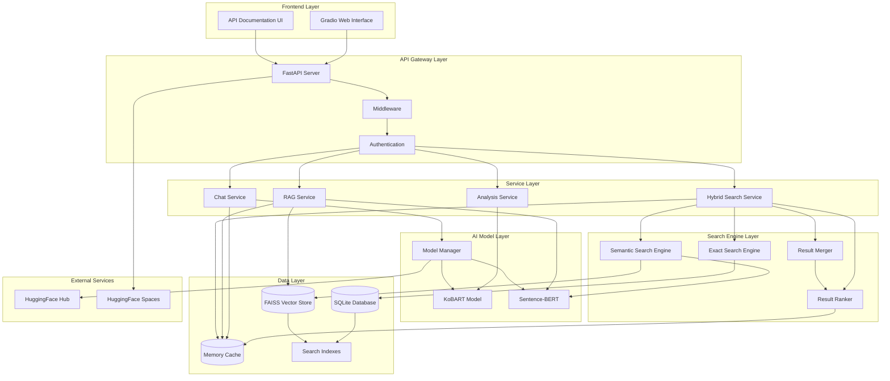
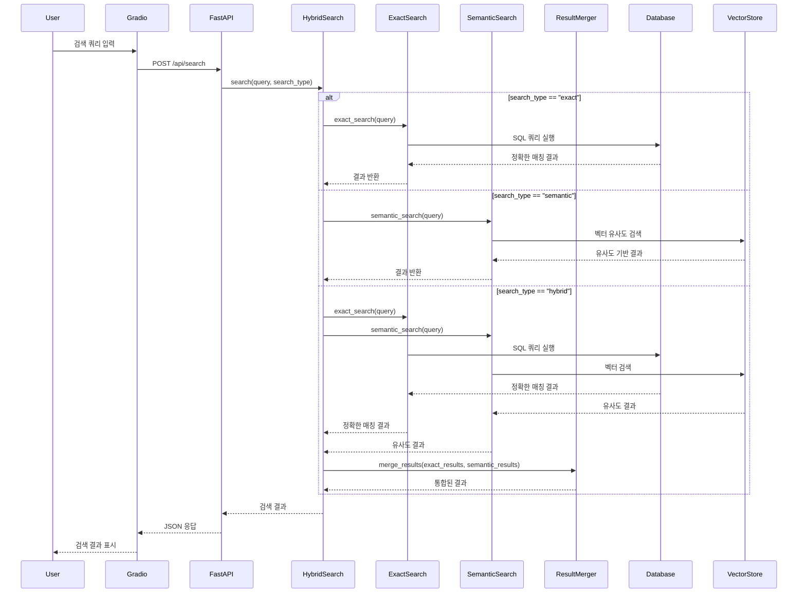

# LawFirmAI 하이브리드 검색 시스템 아키텍처

## 개요

LawFirmAI는 관계형 데이터베이스(SQLite)와 벡터 데이터베이스(FAISS)를 결합한 하이브리드 검색 시스템을 사용하여 정확한 매칭 검색과 의미적 검색을 모두 지원합니다.

## 하이브리드 검색 시스템 아키텍처



## 하이브리드 검색 플로우



## 검색 타입별 특성

### 1. 정확한 매칭 검색 (Exact Search)
- **용도**: 정확한 법령명, 조문번호, 사건번호 검색
- **기술**: SQLite 관계형 데이터베이스
- **장점**: 빠른 속도, 정확한 결과
- **단점**: 유연성 부족, 오타에 민감

```sql
-- 예시: 민법 제1조 정확한 검색
SELECT * FROM legal_documents 
WHERE law_name = '민법' AND article_number = 1;
```

### 2. 의미적 검색 (Semantic Search)
- **용도**: 자연어 쿼리, 맥락적 검색
- **기술**: FAISS 벡터 데이터베이스 + Sentence-BERT
- **장점**: 유연한 검색, 의미적 이해
- **단점**: 상대적으로 느림, 정확도 의존

```python
# 예시: "계약 해지와 관련된 손해배상" 의미적 검색
query_embedding = sentence_bert.encode("계약 해지와 관련된 손해배상")
similar_docs = faiss_index.search(query_embedding, top_k=10)
```

### 3. 하이브리드 검색 (Hybrid Search)
- **용도**: 정확한 매칭과 의미적 검색의 결합
- **기술**: SQLite + FAISS + 결과 통합 알고리즘
- **장점**: 두 검색 방식의 장점 결합
- **단점**: 복잡한 구현, 성능 최적화 필요

## 데이터베이스 스키마 설계

### SQLite 테이블 구조

```sql
-- 법률 문서 메인 테이블
CREATE TABLE legal_documents (
    id INTEGER PRIMARY KEY AUTOINCREMENT,
    document_id TEXT UNIQUE NOT NULL,
    title TEXT NOT NULL,
    content TEXT NOT NULL,
    document_type TEXT NOT NULL, -- 'law', 'precedent', 'constitutional_decision', 'legal_interpretation'
    law_name TEXT,
    article_number INTEGER,
    court_name TEXT,
    case_number TEXT,
    decision_date DATE,
    source_url TEXT,
    created_at TIMESTAMP DEFAULT CURRENT_TIMESTAMP,
    updated_at TIMESTAMP DEFAULT CURRENT_TIMESTAMP
);

-- 벡터 임베딩 연동 테이블
CREATE TABLE document_embeddings (
    id INTEGER PRIMARY KEY AUTOINCREMENT,
    document_id INTEGER NOT NULL,
    chunk_index INTEGER NOT NULL,
    embedding_vector BLOB NOT NULL,
    faiss_index INTEGER NOT NULL,
    created_at TIMESTAMP DEFAULT CURRENT_TIMESTAMP,
    FOREIGN KEY (document_id) REFERENCES legal_documents (id)
);

-- 검색 인덱스
CREATE INDEX idx_document_type ON legal_documents(document_type);
CREATE INDEX idx_law_name ON legal_documents(law_name);
CREATE INDEX idx_article_number ON legal_documents(article_number);
CREATE INDEX idx_court_name ON legal_documents(court_name);
CREATE INDEX idx_decision_date ON legal_documents(decision_date);
CREATE INDEX idx_document_id ON legal_documents(document_id);
```

### FAISS 인덱스 구조

```python
# FAISS 인덱스 설정
index_config = {
    'dimension': 768,  # Sentence-BERT 임베딩 차원
    'index_type': 'IndexFlatIP',  # Inner Product (cosine similarity)
    'normalize': True,  # L2 정규화
    'metric': 'cosine'  # 코사인 유사도
}
```

## 검색 서비스 구현

### 1. 하이브리드 검색 엔진

```python
class HybridSearchEngine:
    def __init__(self, database: DatabaseManager, vector_store: LegalVectorStore):
        self.database = database
        self.vector_store = vector_store
        self.exact_search = ExactSearchEngine(database)
        self.semantic_search = SemanticSearchEngine(vector_store)
        self.result_merger = ResultMerger()
        self.result_ranker = ResultRanker()
    
    def search(self, query: str, search_type: str = "hybrid", 
               filters: Dict[str, Any] = None) -> List[Dict[str, Any]]:
        """하이브리드 검색 실행"""
        if search_type == "exact":
            return self.exact_search.search(query, filters)
        elif search_type == "semantic":
            return self.semantic_search.search(query, filters)
        elif search_type == "hybrid":
            return self._hybrid_search(query, filters)
        else:
            raise ValueError(f"Unknown search type: {search_type}")
    
    def _hybrid_search(self, query: str, filters: Dict[str, Any] = None) -> List[Dict[str, Any]]:
        """하이브리드 검색 실행"""
        # 1. 정확한 매칭 검색
        exact_results = self.exact_search.search(query, filters)
        
        # 2. 의미적 검색
        semantic_results = self.semantic_search.search(query, filters)
        
        # 3. 결과 통합
        merged_results = self.result_merger.merge(exact_results, semantic_results)
        
        # 4. 결과 랭킹
        ranked_results = self.result_ranker.rank(merged_results, query)
        
        return ranked_results
```

### 2. 정확한 매칭 검색 엔진

```python
class ExactSearchEngine:
    def __init__(self, database: DatabaseManager):
        self.database = database
    
    def search(self, query: str, filters: Dict[str, Any] = None) -> List[Dict[str, Any]]:
        """정확한 매칭 검색"""
        # 쿼리 분석
        query_analysis = self._analyze_query(query)
        
        # SQL 쿼리 생성
        sql_query, params = self._build_sql_query(query_analysis, filters)
        
        # 데이터베이스 쿼리 실행
        results = self.database.execute_query(sql_query, params)
        
        return results
    
    def _analyze_query(self, query: str) -> Dict[str, Any]:
        """쿼리 분석"""
        # 법령명, 조문번호, 사건번호 등 패턴 인식
        pass
    
    def _build_sql_query(self, query_analysis: Dict[str, Any], 
                        filters: Dict[str, Any] = None) -> Tuple[str, List]:
        """SQL 쿼리 생성"""
        pass
```

### 3. 의미적 검색 엔진

```python
class SemanticSearchEngine:
    def __init__(self, vector_store: LegalVectorStore):
        self.vector_store = vector_store
    
    def search(self, query: str, filters: Dict[str, Any] = None) -> List[Dict[str, Any]]:
        """의미적 검색"""
        # 쿼리 임베딩 생성
        query_embedding = self.vector_store.generate_embeddings([query])
        
        # 벡터 검색
        similar_docs = self.vector_store.search(query, top_k=20)
        
        # 필터 적용
        if filters:
            similar_docs = self._apply_filters(similar_docs, filters)
        
        return similar_docs
    
    def _apply_filters(self, results: List[Dict[str, Any]], 
                      filters: Dict[str, Any]) -> List[Dict[str, Any]]:
        """결과 필터링"""
        pass
```

### 4. 결과 통합 및 랭킹

```python
class ResultMerger:
    def merge(self, exact_results: List[Dict[str, Any]], 
              semantic_results: List[Dict[str, Any]]) -> List[Dict[str, Any]]:
        """검색 결과 통합"""
        # 중복 제거
        merged_results = self._remove_duplicates(exact_results, semantic_results)
        
        # 결과 통합
        return merged_results
    
    def _remove_duplicates(self, exact_results: List[Dict[str, Any]], 
                          semantic_results: List[Dict[str, Any]]) -> List[Dict[str, Any]]:
        """중복 제거"""
        pass

class ResultRanker:
    def rank(self, results: List[Dict[str, Any]], query: str) -> List[Dict[str, Any]]:
        """결과 랭킹"""
        # 정확한 매칭 결과 우선순위 부여
        # 의미적 유사도 점수 적용
        # 최종 랭킹 계산
        pass
```

## 성능 최적화 전략

### 1. 인덱싱 전략
- **SQLite 인덱스**: 자주 검색되는 컬럼에 인덱스 생성
- **FAISS 인덱스**: 벡터 차원 최적화, 인덱스 타입 선택
- **복합 인덱스**: 여러 컬럼 조합 인덱스 생성

### 2. 캐싱 전략
- **쿼리 캐싱**: 자주 사용되는 쿼리 결과 캐싱
- **임베딩 캐싱**: 계산된 임베딩 벡터 캐싱
- **결과 캐싱**: 검색 결과 캐싱

### 3. 비동기 처리
- **병렬 검색**: 정확한 매칭과 의미적 검색 병렬 실행
- **배치 처리**: 대량 검색 요청 배치 처리
- **비동기 로딩**: 모델 및 데이터 비동기 로딩

## API 엔드포인트 설계

### 1. 검색 API

```python
# GET /api/search
{
    "query": "계약 해지 손해배상",
    "search_type": "hybrid",  # "exact", "semantic", "hybrid"
    "filters": {
        "document_type": "precedent",
        "court_name": "대법원",
        "year": 2023
    },
    "limit": 20,
    "offset": 0
}

# 응답
{
    "results": [
        {
            "id": 1,
            "title": "계약 해지와 관련된 손해배상 청구권",
            "content": "계약 당사자 간의 의무 위반 시...",
            "document_type": "precedent",
            "court_name": "대법원",
            "case_number": "2023다12345",
            "decision_date": "2023-01-15",
            "similarity_score": 0.95,
            "exact_match": true,
            "source_url": "https://..."
        }
    ],
    "total_count": 150,
    "search_time": 0.123,
    "search_type": "hybrid"
}
```

### 2. 고급 검색 API

```python
# POST /api/search/advanced
{
    "queries": [
        {
            "query": "계약 해지",
            "search_type": "semantic",
            "weight": 0.7
        },
        {
            "query": "손해배상",
            "search_type": "exact",
            "weight": 0.3
        }
    ],
    "filters": {
        "document_type": "precedent",
        "date_range": {
            "start": "2020-01-01",
            "end": "2023-12-31"
        }
    },
    "ranking_strategy": "weighted_hybrid"
}
```

## 모니터링 및 로깅

### 1. 성능 메트릭
- **검색 응답 시간**: 각 검색 타입별 평균 응답 시간
- **정확도**: 검색 결과의 정확도 측정
- **사용자 만족도**: 검색 결과 클릭률, 체류 시간

### 2. 로깅 전략
- **검색 쿼리 로깅**: 사용자 검색 패턴 분석
- **성능 로깅**: 검색 성능 모니터링
- **에러 로깅**: 검색 실패 원인 분석

### 3. 알림 시스템
- **성능 저하 알림**: 검색 응답 시간 임계값 초과 시
- **에러 알림**: 검색 실패율 증가 시
- **용량 알림**: 데이터베이스 용량 부족 시

## 배포 및 확장성

### 1. Docker 컨테이너화
- **데이터베이스 컨테이너**: SQLite 데이터베이스
- **벡터 스토어 컨테이너**: FAISS 인덱스
- **검색 서비스 컨테이너**: 하이브리드 검색 엔진

### 2. 확장성 전략
- **수평 확장**: 검색 서비스 인스턴스 추가
- **데이터 분할**: 데이터베이스 샤딩
- **캐시 확장**: Redis 클러스터 구축

### 3. 백업 및 복구
- **데이터 백업**: 정기적인 데이터베이스 백업
- **인덱스 백업**: FAISS 인덱스 백업
- **복구 전략**: 장애 시 빠른 복구 방안

이 하이브리드 검색 시스템을 통해 LawFirmAI는 정확한 법률 정보 검색과 의미적 검색을 모두 지원하여 사용자에게 더 나은 검색 경험을 제공할 수 있습니다.
