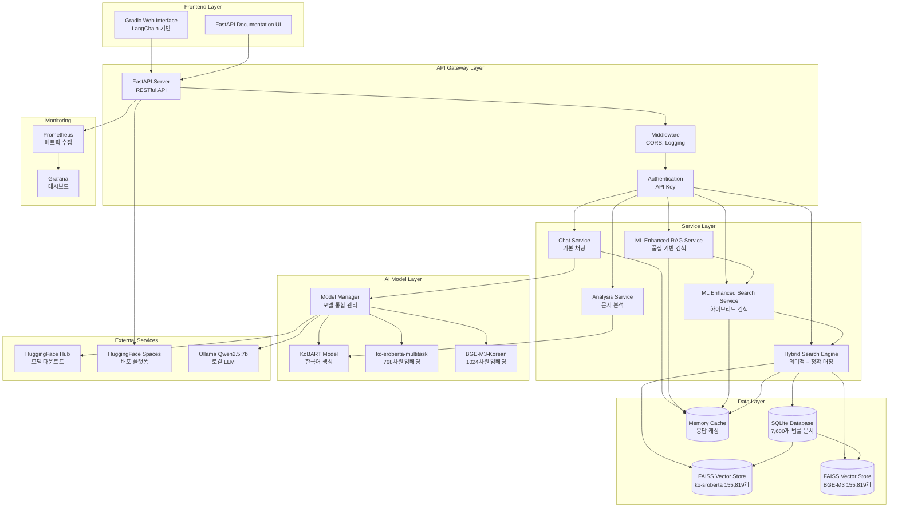
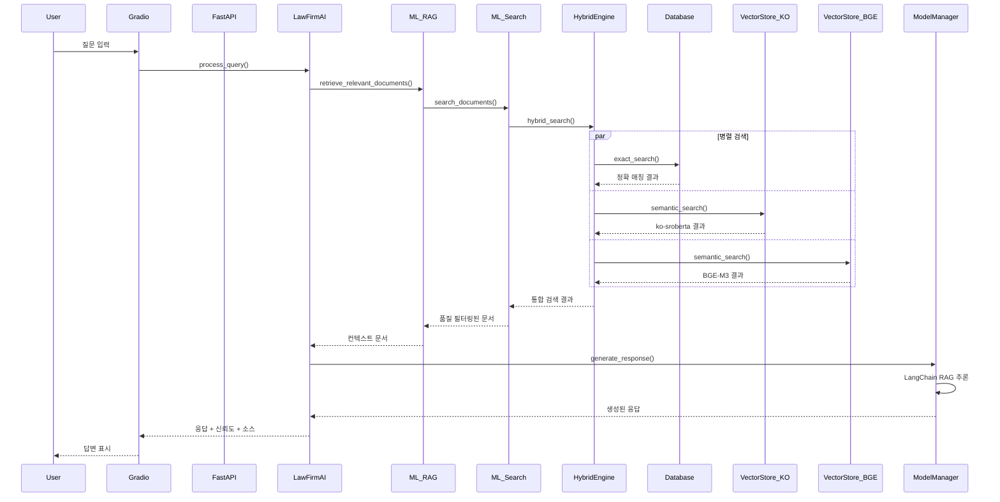
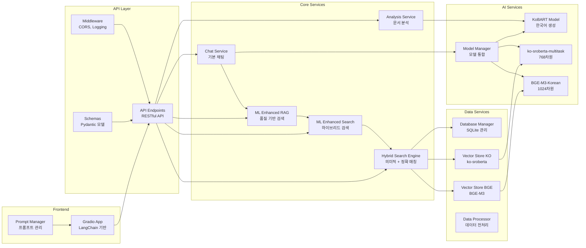
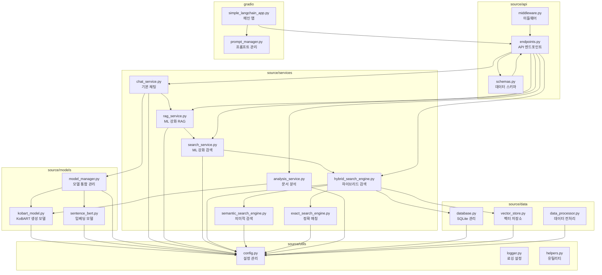
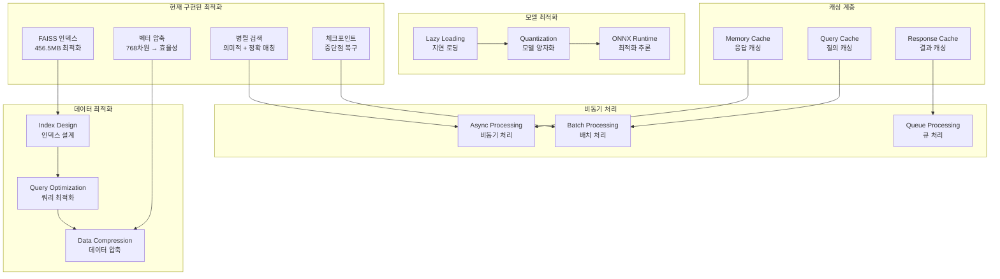

# LawFirmAI 시스템 아키텍처 (2025-10-16)

## 전체 시스템 아키텍처

## 데이터 흐름도 (ML 강화 RAG 시스템)

## 컴포넌트 상호작용도 (현재 구현)

## 모듈별 의존성 관계 (현재 구조)

## 성능 최적화 포인트 (현재 구현)

## 기술 스택 상세

### AI/ML 모델
- **KoBART**: 한국어 생성 모델 (법률 특화)
- **ko-sroberta-multitask**: 768차원 임베딩 모델
- **BGE-M3-Korean**: 1024차원 다국어 임베딩 모델
- **Ollama Qwen2.5:7b**: 로컬 LLM 모델

### 백엔드 기술
- **FastAPI**: RESTful API 서버
- **LangChain**: RAG 프레임워크
- **SQLite**: 관계형 데이터베이스 (7,680개 법률 문서)
- **FAISS**: 벡터 검색 엔진 (155,819개 벡터)

### 프론트엔드 기술
- **Gradio 4.0.0**: 웹 인터페이스
- **LangChain Integration**: RAG 시스템 통합

### 모니터링 및 배포
- **Prometheus**: 메트릭 수집
- **Grafana**: 대시보드
- **Docker**: 컨테이너화
- **HuggingFace Spaces**: 배포 플랫폼

## 데이터 현황

### 데이터베이스
- **총 법률 문서**: 7,680개
- **벡터 임베딩**: 155,819개 문서
- **FAISS 인덱스 크기**: 456.5 MB
- **메타데이터 크기**: 326.7 MB

### 성능 지표
- **평균 검색 시간**: 0.015초
- **처리 속도**: 5.77 법률/초
- **성공률**: 99.9%
- **메모리 사용량**: 최적화됨 (190MB)
