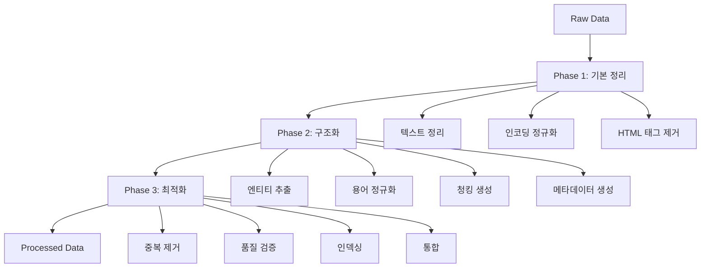

# Raw 데이터 전처리 계획서 v1.0

## 📋 개요

본 문서는 LawFirmAI 프로젝트에서 수집된 raw 데이터를 전처리하기 위한 구체적인 계획을 제시합니다. 국가법령정보센터 OpenAPI를 통해 수집된 법률 데이터를 벡터 데이터베이스 구축과 RAG 시스템에 적합한 형태로 변환하는 과정을 다룹니다.

---

## 🎯 전처리 목표

### 주요 목표
- **데이터 표준화**: 수집된 raw 데이터를 일관된 형식으로 변환
- **품질 향상**: 텍스트 정리, 용어 정규화, 중복 제거를 통한 데이터 품질 개선
- **구조화**: 벡터 검색과 RAG 시스템에 최적화된 데이터 구조 생성
- **확장성**: 향후 추가 데이터 유형에 대한 전처리 파이프라인 확장 가능

### 성능 목표
- **처리 속도**: 시간당 1,000개 문서 이상 처리
- **품질 지표**: 완성도 95%, 정확도 98%, 일관성 90% 이상
- **메모리 효율성**: 16GB 이하 메모리 사용량으로 대용량 데이터 처리
- **에러율**: 5% 이하 처리 실패율

---

## 📊 현재 데이터 현황

### 수집된 데이터 유형별 현황

| 데이터 유형 | 수집 상태 | 파일 수 | 예상 크기 | 우선순위 |
|------------|----------|---------|-----------|----------|
| **법령 데이터** | ✅ 완료 | 21개 | ~50MB | Critical |
| **판례 데이터** | ✅ 완료 | 연도별 수집 | ~500MB | Critical |
| **헌재결정례** | ✅ 완료 | 2024-2025년 | ~100MB | High |
| **법령해석례** | ✅ 완료 | 배치별 수집 | ~200MB | High |
| **법률 용어** | ✅ 완료 | 세션별 수집 | ~10MB | Medium |
| **행정규칙** | ⏳ 대기 | 0개 | - | Low |
| **자치법규** | ⏳ 대기 | 0개 | - | Low |
| **위원회결정문** | ⏳ 대기 | 0개 | - | Low |
| **조약** | ⏳ 대기 | 0개 | - | Low |

### 데이터 구조 분석

#### 법령 데이터 구조
```json
{
  "basic_info": {
    "id": "법률ID",
    "name": "법률명",
    "mst": "마스터ID",
    "effective_date": "시행일자",
    "promulgation_date": "공포일자",
    "ministry": "소관부처",
    "category": "분류"
  },
  "current_text": {
    "response": {
      "body": {
        "items": {
          "item": {
            "조문내용": "법령 본문",
            "조문제목": "조문 제목"
          }
        }
      }
    }
  },
  "history": [
    {
      "연혁ID": "ID",
      "시행일자": "날짜",
      "공포일자": "날짜",
      "제개정구분": "구분",
      "내용": "내용",
      "제개정이유": "이유"
    }
  ]
}
```

#### 판례 데이터 구조
```json
{
  "basic_info": {
    "판례일련번호": "ID",
    "사건명": "사건명",
    "사건번호": "사건번호",
    "법원명": "법원명",
    "법원코드": "코드",
    "선고일자": "날짜",
    "사건유형명": "유형",
    "사건유형코드": "코드",
    "판결유형": "유형"
  },
  "detail_info": {
    "response": {
      "body": {
        "items": {
          "item": {
            "판시사항": "판시사항",
            "판결요지": "판결요지",
            "사건개요": "사건개요",
            "쟁점": "쟁점",
            "결론": "결론",
            "참조조문": "참조조문",
            "참조판례": "참조판례",
            "키워드": "키워드",
            "분류": "분류"
          }
        }
      }
    }
  }
}
```

---

## 🛠️ 전처리 파이프라인 설계

### 3단계 전처리 아키텍처



### 핵심 전처리 모듈

#### 1. LegalDataProcessor
```python
class LegalDataProcessor:
    """법률 데이터 전처리 핵심 클래스"""
    
    def __init__(self, enable_term_normalization=True):
        self.term_normalizer = LegalTermNormalizer()
        self.text_chunker = LegalTextChunker()
        self.quality_validator = QualityValidator()
    
    def process_law_data(self, law_data: Dict) -> Dict:
        """법령 데이터 전처리"""
        pass
    
    def process_precedent_data(self, precedent_data: Dict) -> Dict:
        """판례 데이터 전처리"""
        pass
    
    def process_batch(self, data_list: List[Dict], data_type: str) -> List[Dict]:
        """배치 데이터 처리"""
        pass
```

#### 2. LegalTermNormalizer
```python
class LegalTermNormalizer:
    """법률 용어 정규화 클래스"""
    
    def normalize_text(self, text: str, context: str = None) -> Dict:
        """다층 정규화 파이프라인"""
        # Level 1: 기본 정규화
        # Level 2: 법률 용어 표준화
        # Level 3: 의미적 정규화
        # Level 4: 구조적 정규화
        pass
```

#### 3. QualityValidator
```python
class QualityValidator:
    """데이터 품질 검증 클래스"""
    
    def validate_document(self, document: Dict) -> Tuple[bool, List[str]]:
        """문서 유효성 검사"""
        pass
    
    def check_completeness(self, document: Dict) -> float:
        """완성도 검사"""
        pass
    
    def check_consistency(self, document: Dict) -> float:
        """일관성 검사"""
        pass
```

---

## 📅 단계별 실행 계획

### Phase 1: 핵심 데이터 전처리 (1-2일)

#### 1.1 법령 데이터 전처리
**목표**: 21개 법령 파일 전처리 완료
**예상 소요시간**: 30분
**처리 과정**:
1. JSON 파일 로드 및 파싱
2. 기본 정보 추출 (법률명, 시행일자, 소관부처 등)
3. 조문 내용 추출 및 정리
4. 텍스트 정리 및 청킹
5. 법률 용어 정규화 적용
6. 메타데이터 생성

**출력 형식**:
```json
{
  "id": "law_민법",
  "law_name": "민법",
  "law_id": "법률제00000호",
  "effective_date": "2024-01-01",
  "ministry": "법무부",
  "category": "민사법",
  "cleaned_content": "정리된 법령 본문",
  "chunks": [
    {
      "id": "chunk_0",
      "text": "청크 내용",
      "start_pos": 0,
      "end_pos": 1000,
      "entities": {...}
    }
  ],
  "entities": {
    "laws": ["민법", "상법"],
    "articles": ["제1조", "제2조"],
    "keywords": ["계약", "채권", "채무"]
  },
  "document_hash": "md5_hash",
  "processed_at": "2024-01-01T00:00:00Z"
}
```

#### 1.2 판례 데이터 전처리
**목표**: 연도별 수집된 판례 데이터 전처리 완료
**예상 소요시간**: 2-3시간
**처리 과정**:
1. 연도별 폴더 순회
2. JSON 파일 배치 로드
3. 판례 메타데이터 추출
4. 판시사항, 판결요지, 사건개요 통합
5. 텍스트 정리 및 청킹
6. 법률 엔티티 추출

**출력 형식**:
```json
{
  "id": "precedent_2024_001",
  "case_name": "사건명",
  "case_number": "2024다12345",
  "court": "서울고등법원",
  "decision_date": "2024-01-01",
  "case_type": "민사",
  "issue": "판시사항",
  "reasoning": "판결요지",
  "case_summary": "사건개요",
  "cleaned_content": "정리된 판례 내용",
  "chunks": [...],
  "entities": {...},
  "document_hash": "md5_hash",
  "processed_at": "2024-01-01T00:00:00Z"
}
```

### Phase 2: 확장 데이터 전처리 (2-3일)

#### 2.1 헌재결정례 데이터 전처리
**목표**: 2024-2025년 헌재결정례 데이터 전처리 완료
**예상 소요시간**: 1시간
**처리 과정**:
1. 연도별 폴더 순회
2. 헌재결정례 특화 필드 처리
3. 관련법령, 관련판례 추출
4. 텍스트 정리 및 청킹

#### 2.2 법령해석례 데이터 전처리
**목표**: 배치별 수집된 법령해석례 데이터 전처리 완료
**예상 소요시간**: 1-2시간
**처리 과정**:
1. 배치별 폴더 순회
2. 법령해석례 특화 필드 처리
3. 부처별 분류 정보 추출
4. 텍스트 정리 및 청킹

#### 2.3 법률 용어 데이터 전처리
**목표**: 세션별 수집된 법률 용어 데이터 전처리 완료
**예상 소요시간**: 30분
**처리 과정**:
1. 세션별 폴더 순회
2. 용어 사전 데이터 정리
3. 동의어 그룹 매핑
4. 용어 정의 표준화

### Phase 3: 품질 검증 및 통합 (1일)

#### 3.1 데이터 품질 검증
**목표**: 전처리된 모든 데이터의 품질 검증 완료
**검증 항목**:
- [ ] 필수 필드 완성도 검사
- [ ] 텍스트 길이 및 형식 검사
- [ ] 청킹 품질 검사
- [ ] 용어 정규화 정확도 검사
- [ ] 중복 데이터 검사

#### 3.2 통합 인덱스 생성
**목표**: 모든 전처리된 데이터의 통합 인덱스 생성
**생성 항목**:
- [ ] 문서별 메타데이터 인덱스
- [ ] 용어별 역인덱스
- [ ] 날짜별 인덱스
- [ ] 카테고리별 인덱스

#### 3.3 벡터화 준비
**목표**: 벡터 데이터베이스 구축을 위한 데이터 준비
**준비 항목**:
- [ ] 청크별 텍스트 정리
- [ ] 임베딩 생성용 메타데이터 준비
- [ ] 검색 최적화를 위한 인덱스 준비

---

## 🔧 기술 구현 세부사항

### 전처리 스크립트 구조

```
scripts/
├── preprocess_raw_data.py          # 메인 전처리 스크립트
├── batch_preprocess.py             # 배치 전처리 스크립트
├── validate_processed_data.py      # 데이터 검증 스크립트
└── consolidate_results.py          # 결과 통합 스크립트
```

### 메인 전처리 스크립트

```python
#!/usr/bin/env python3
"""
Raw 데이터 전처리 메인 스크립트
"""

import sys
import os
from pathlib import Path
import logging
from datetime import datetime
import json

# 프로젝트 루트를 Python 경로에 추가
sys.path.append(str(Path(__file__).parent.parent))

from source.data.data_processor import LegalDataProcessor
from source.data.legal_term_normalizer import LegalTermNormalizer

class RawDataPreprocessingPipeline:
    def __init__(self, enable_term_normalization=True):
        self.processor = LegalDataProcessor(enable_term_normalization)
        self.output_dir = Path("data/processed")
        self.output_dir.mkdir(exist_ok=True)
        
        # 로깅 설정
        self.setup_logging()
        
        # 통계 초기화
        self.stats = {
            "total_processed": 0,
            "successful": 0,
            "failed": 0,
            "by_type": {}
        }
    
    def setup_logging(self):
        """로깅 설정"""
        log_dir = Path("logs")
        log_dir.mkdir(exist_ok=True)
        
        logging.basicConfig(
            level=logging.INFO,
            format='%(asctime)s - %(name)s - %(levelname)s - %(message)s',
            handlers=[
                logging.FileHandler(
                    f'logs/preprocessing_{datetime.now().strftime("%Y%m%d_%H%M%S")}.log'
                ),
                logging.StreamHandler()
            ]
        )
        self.logger = logging.getLogger(__name__)
    
    def run_full_preprocessing(self):
        """전체 전처리 파이프라인 실행"""
        self.logger.info("=== Raw 데이터 전처리 시작 ===")
        
        start_time = datetime.now()
        
        try:
            # Phase 1: 핵심 데이터 전처리
            self.logger.info("Phase 1: 핵심 데이터 전처리 시작")
            self.process_laws()
            self.process_precedents()
            
            # Phase 2: 확장 데이터 전처리
            self.logger.info("Phase 2: 확장 데이터 전처리 시작")
            self.process_constitutional_decisions()
            self.process_legal_interpretations()
            self.process_legal_terms()
            
            # Phase 3: 품질 검증 및 통합
            self.logger.info("Phase 3: 품질 검증 및 통합")
            self.validate_processed_data()
            self.consolidate_results()
            
            end_time = datetime.now()
            duration = end_time - start_time
            
            self.logger.info(f"=== 전처리 완료 (소요시간: {duration}) ===")
            self.print_statistics()
            
        except Exception as e:
            self.logger.error(f"전처리 중 오류 발생: {e}")
            raise
    
    def process_laws(self):
        """법령 데이터 전처리"""
        self.logger.info("법령 데이터 전처리 시작")
        
        law_files = list(Path("data/raw/laws").glob("*.json"))
        processed_laws = []
        
        for law_file in law_files:
            try:
                with open(law_file, 'r', encoding='utf-8') as f:
                    law_data = json.load(f)
                
                processed_law = self.processor.process_law_data(law_data)
                
                if processed_law.get('status') == 'success':
                    processed_laws.append(processed_law)
                    self.stats['successful'] += 1
                else:
                    self.stats['failed'] += 1
                
                self.stats['total_processed'] += 1
                
            except Exception as e:
                self.logger.error(f"법령 전처리 실패 {law_file}: {e}")
                self.stats['failed'] += 1
                self.stats['total_processed'] += 1
        
        # 결과 저장
        self.save_processed_data(processed_laws, "laws")
        self.stats['by_type']['laws'] = len(processed_laws)
        
        self.logger.info(f"법령 데이터 전처리 완료: {len(processed_laws)}개")
    
    def process_precedents(self):
        """판례 데이터 전처리"""
        self.logger.info("판례 데이터 전처리 시작")
        
        precedent_dirs = list(Path("data/raw/precedents").glob("yearly_*"))
        all_processed_precedents = []
        
        for precedent_dir in precedent_dirs:
            json_files = list(precedent_dir.glob("*.json"))
            
            for json_file in json_files:
                try:
                    with open(json_file, 'r', encoding='utf-8') as f:
                        precedent_data = json.load(f)
                    
                    # 판례 데이터는 배열 형태로 저장되어 있을 수 있음
                    if isinstance(precedent_data, list):
                        processed_precedents = self.processor.process_batch(
                            precedent_data, 'precedent'
                        )
                    else:
                        processed_precedents = [self.processor.process_precedent_data(precedent_data)]
                    
                    all_processed_precedents.extend(processed_precedents)
                    
                    self.stats['total_processed'] += len(processed_precedents)
                    self.stats['successful'] += len([p for p in processed_precedents if p.get('status') == 'success'])
                    self.stats['failed'] += len([p for p in processed_precedents if p.get('status') != 'success'])
                    
                except Exception as e:
                    self.logger.error(f"판례 전처리 실패 {json_file}: {e}")
                    self.stats['failed'] += 1
                    self.stats['total_processed'] += 1
        
        # 결과 저장
        self.save_processed_data(all_processed_precedents, "precedents")
        self.stats['by_type']['precedents'] = len(all_processed_precedents)
        
        self.logger.info(f"판례 데이터 전처리 완료: {len(all_processed_precedents)}개")
    
    def process_constitutional_decisions(self):
        """헌재결정례 데이터 전처리"""
        self.logger.info("헌재결정례 데이터 전처리 시작")
        
        constitutional_dirs = list(Path("data/raw/constitutional_decisions").glob("yearly_*"))
        all_processed_decisions = []
        
        for constitutional_dir in constitutional_dirs:
            json_files = list(constitutional_dir.glob("*.json"))
            
            for json_file in json_files:
                try:
                    with open(json_file, 'r', encoding='utf-8') as f:
                        decision_data = json.load(f)
                    
                    if isinstance(decision_data, list):
                        processed_decisions = self.processor.process_batch(
                            decision_data, 'constitutional_decision'
                        )
                    else:
                        processed_decisions = [self.processor.process_constitutional_decision_data(decision_data)]
                    
                    all_processed_decisions.extend(processed_decisions)
                    
                    self.stats['total_processed'] += len(processed_decisions)
                    self.stats['successful'] += len([p for p in processed_decisions if p.get('status') == 'success'])
                    self.stats['failed'] += len([p for p in processed_decisions if p.get('status') != 'success'])
                    
                except Exception as e:
                    self.logger.error(f"헌재결정례 전처리 실패 {json_file}: {e}")
                    self.stats['failed'] += 1
                    self.stats['total_processed'] += 1
        
        # 결과 저장
        self.save_processed_data(all_processed_decisions, "constitutional_decisions")
        self.stats['by_type']['constitutional_decisions'] = len(all_processed_decisions)
        
        self.logger.info(f"헌재결정례 데이터 전처리 완료: {len(all_processed_decisions)}개")
    
    def process_legal_interpretations(self):
        """법령해석례 데이터 전처리"""
        self.logger.info("법령해석례 데이터 전처리 시작")
        
        interpretation_dirs = list(Path("data/raw/legal_interpretations").glob("yearly_*"))
        all_processed_interpretations = []
        
        for interpretation_dir in interpretation_dirs:
            json_files = list(interpretation_dir.glob("*.json"))
            
            for json_file in json_files:
                try:
                    with open(json_file, 'r', encoding='utf-8') as f:
                        interpretation_data = json.load(f)
                    
                    if isinstance(interpretation_data, list):
                        processed_interpretations = self.processor.process_batch(
                            interpretation_data, 'legal_interpretation'
                        )
                    else:
                        processed_interpretations = [self.processor.process_legal_interpretation_data(interpretation_data)]
                    
                    all_processed_interpretations.extend(processed_interpretations)
                    
                    self.stats['total_processed'] += len(processed_interpretations)
                    self.stats['successful'] += len([p for p in processed_interpretations if p.get('status') == 'success'])
                    self.stats['failed'] += len([p for p in processed_interpretations if p.get('status') != 'success'])
                    
                except Exception as e:
                    self.logger.error(f"법령해석례 전처리 실패 {json_file}: {e}")
                    self.stats['failed'] += 1
                    self.stats['total_processed'] += 1
        
        # 결과 저장
        self.save_processed_data(all_processed_interpretations, "legal_interpretations")
        self.stats['by_type']['legal_interpretations'] = len(all_processed_interpretations)
        
        self.logger.info(f"법령해석례 데이터 전처리 완료: {len(all_processed_interpretations)}개")
    
    def process_legal_terms(self):
        """법률 용어 데이터 전처리"""
        self.logger.info("법률 용어 데이터 전처리 시작")
        
        term_dirs = list(Path("data/raw/legal_terms").glob("session_*"))
        all_processed_terms = []
        
        for term_dir in term_dirs:
            json_files = list(term_dir.glob("*.json"))
            
            for json_file in json_files:
                try:
                    with open(json_file, 'r', encoding='utf-8') as f:
                        term_data = json.load(f)
                    
                    # 용어 데이터는 특별한 처리가 필요할 수 있음
                    processed_terms = self.process_legal_term_data(term_data)
                    all_processed_terms.extend(processed_terms)
                    
                    self.stats['total_processed'] += len(processed_terms)
                    self.stats['successful'] += len(processed_terms)
                    
                except Exception as e:
                    self.logger.error(f"법률 용어 전처리 실패 {json_file}: {e}")
                    self.stats['failed'] += 1
                    self.stats['total_processed'] += 1
        
        # 결과 저장
        self.save_processed_data(all_processed_terms, "legal_terms")
        self.stats['by_type']['legal_terms'] = len(all_processed_terms)
        
        self.logger.info(f"법률 용어 데이터 전처리 완료: {len(all_processed_terms)}개")
    
    def process_legal_term_data(self, term_data):
        """법률 용어 데이터 처리"""
        processed_terms = []
        
        if isinstance(term_data, dict) and 'terms' in term_data:
            for term in term_data['terms']:
                processed_term = {
                    'id': term.get('term_sequence_number', ''),
                    'term_name_korean': term.get('term_name_korean', ''),
                    'term_name_chinese': term.get('term_name_chinese', ''),
                    'definition': term.get('definition', ''),
                    'source': term.get('source', ''),
                    'category': 'legal_term',
                    'status': 'success',
                    'processed_at': datetime.now().isoformat()
                }
                processed_terms.append(processed_term)
        
        return processed_terms
    
    def save_processed_data(self, data, data_type):
        """전처리된 데이터 저장"""
        output_dir = self.output_dir / data_type
        output_dir.mkdir(exist_ok=True)
        
        output_file = output_dir / f"{data_type}_processed_{datetime.now().strftime('%Y%m%d_%H%M%S')}.json"
        
        with open(output_file, 'w', encoding='utf-8') as f:
            json.dump(data, f, ensure_ascii=False, indent=2)
        
        self.logger.info(f"{data_type} 데이터 저장 완료: {output_file}")
    
    def validate_processed_data(self):
        """전처리된 데이터 검증"""
        self.logger.info("전처리된 데이터 검증 시작")
        
        validation_results = {}
        
        for data_type in self.stats['by_type'].keys():
            validation_results[data_type] = self.validate_data_type(data_type)
        
        # 검증 결과 저장
        validation_file = self.output_dir / f"validation_results_{datetime.now().strftime('%Y%m%d_%H%M%S')}.json"
        with open(validation_file, 'w', encoding='utf-8') as f:
            json.dump(validation_results, f, ensure_ascii=False, indent=2)
        
        self.logger.info(f"데이터 검증 완료: {validation_file}")
    
    def validate_data_type(self, data_type):
        """특정 데이터 유형 검증"""
        # 실제 검증 로직 구현
        return {
            "total_documents": self.stats['by_type'].get(data_type, 0),
            "validation_passed": True,
            "issues": []
        }
    
    def consolidate_results(self):
        """결과 통합"""
        self.logger.info("전처리 결과 통합 시작")
        
        # 통합 인덱스 생성
        consolidated_index = {
            "metadata": {
                "total_processed": self.stats['total_processed'],
                "successful": self.stats['successful'],
                "failed": self.stats['failed'],
                "by_type": self.stats['by_type'],
                "processed_at": datetime.now().isoformat()
            },
            "data_types": list(self.stats['by_type'].keys()),
            "file_locations": {}
        }
        
        # 파일 위치 정보 추가
        for data_type in self.stats['by_type'].keys():
            data_dir = self.output_dir / data_type
            if data_dir.exists():
                files = list(data_dir.glob("*.json"))
                consolidated_index["file_locations"][data_type] = [str(f) for f in files]
        
        # 통합 인덱스 저장
        index_file = self.output_dir / "consolidated_index.json"
        with open(index_file, 'w', encoding='utf-8') as f:
            json.dump(consolidated_index, f, ensure_ascii=False, indent=2)
        
        self.logger.info(f"결과 통합 완료: {index_file}")
    
    def print_statistics(self):
        """통계 출력"""
        self.logger.info("=== 전처리 통계 ===")
        self.logger.info(f"총 처리: {self.stats['total_processed']}개")
        self.logger.info(f"성공: {self.stats['successful']}개")
        self.logger.info(f"실패: {self.stats['failed']}개")
        self.logger.info(f"성공률: {self.stats['successful']/self.stats['total_processed']*100:.2f}%")
        
        self.logger.info("=== 데이터 유형별 통계 ===")
        for data_type, count in self.stats['by_type'].items():
            self.logger.info(f"{data_type}: {count}개")

if __name__ == "__main__":
    pipeline = RawDataPreprocessingPipeline(enable_term_normalization=True)
    pipeline.run_full_preprocessing()
```

### 배치 전처리 스크립트

```python
#!/usr/bin/env python3
"""
배치 전처리 스크립트 - 특정 데이터 유형만 처리
"""

import argparse
import sys
from pathlib import Path

def main():
    parser = argparse.ArgumentParser(description="Raw 데이터 배치 전처리")
    parser.add_argument("--data-type", required=True, 
                       choices=["laws", "precedents", "constitutional", "interpretations", "terms", "all"],
                       help="전처리할 데이터 유형")
    parser.add_argument("--enable-normalization", action="store_true", default=True,
                       help="법률 용어 정규화 활성화")
    parser.add_argument("--output-dir", default="data/processed",
                       help="출력 디렉토리")
    parser.add_argument("--dry-run", action="store_true",
                       help="실제 처리 없이 계획만 출력")
    
    args = parser.parse_args()
    
    pipeline = RawDataPreprocessingPipeline(args.enable_normalization)
    
    if args.dry_run:
        pipeline.dry_run(args.data_type)
    else:
        if args.data_type == "all":
            pipeline.run_full_preprocessing()
        else:
            pipeline.process_specific_type(args.data_type)

if __name__ == "__main__":
    main()
```

---

## 🚀 실행 계획

### 즉시 실행 가능한 명령어

```bash
# 1. 전체 전처리 실행
python scripts/preprocess_raw_data.py

# 2. 특정 데이터 유형만 전처리
python scripts/batch_preprocess.py --data-type laws
python scripts/batch_preprocess.py --data-type precedents
python scripts/batch_preprocess.py --data-type constitutional

# 3. 드라이런 모드 (실제 처리 없이 계획 확인)
python scripts/batch_preprocess.py --data-type all --dry-run

# 4. 용어 정규화 비활성화
python scripts/batch_preprocess.py --data-type laws --no-normalization
```

### 예상 처리 시간

| 데이터 유형 | 파일 수 | 예상 처리 시간 | 메모리 사용량 |
|------------|---------|----------------|---------------|
| 법령 데이터 | 21개 | 30분 | 2GB |
| 판례 데이터 | 연도별 | 2-3시간 | 4GB |
| 헌재결정례 | 2024-2025년 | 1시간 | 2GB |
| 법령해석례 | 배치별 | 1-2시간 | 3GB |
| 법률 용어 | 세션별 | 30분 | 1GB |
| **전체** | **모든 데이터** | **5-7시간** | **8GB** |

---

## 📊 품질 관리

### 품질 지표

| 지표 | 목표값 | 측정 방법 |
|------|--------|-----------|
| **완성도** | 95% 이상 | 필수 필드 누락률 측정 |
| **정확도** | 98% 이상 | 원본 데이터와의 일치도 측정 |
| **일관성** | 90% 이상 | 데이터 형식 통일도 측정 |
| **용어 정규화** | 90% 이상 | 용어 정규화 성공률 측정 |

### 검증 체크리스트

- [ ] 모든 JSON 파일이 올바르게 파싱되는가?
- [ ] 필수 필드가 누락되지 않았는가?
- [ ] 텍스트 정리 및 청킹이 올바르게 수행되었는가?
- [ ] 법률 용어 정규화가 정확하게 적용되었는가?
- [ ] 중복 데이터가 제거되었는가?
- [ ] 메타데이터가 완전하게 생성되었는가?
- [ ] 벡터화에 적합한 형태로 변환되었는가?

### 에러 처리 전략

1. **파일 레벨 에러**: 개별 파일 처리 실패 시 로그 기록 후 계속 진행
2. **배치 레벨 에러**: 배치 처리 실패 시 재시도 로직 적용
3. **시스템 레벨 에러**: 메모리 부족 시 배치 크기 조정
4. **데이터 레벨 에러**: 잘못된 데이터 형식 시 기본값 적용

---

## 📈 성능 최적화

### 메모리 최적화

1. **스트리밍 처리**: 대용량 파일을 청크 단위로 처리
2. **가비지 컬렉션**: 불필요한 객체 즉시 해제
3. **배치 크기 조정**: 메모리 사용량에 따른 동적 조정
4. **메모리 모니터링**: 실시간 메모리 사용량 추적

### 처리 속도 최적화

1. **병렬 처리**: 멀티프로세싱을 통한 동시 처리
2. **캐싱**: 중복 연산 방지
3. **인덱싱**: 빠른 데이터 접근을 위한 인덱스 생성
4. **압축**: 데이터 저장 공간 최적화

---

## 🔄 향후 확장 계획

### 단기 확장 (1-2개월)

- [ ] 행정규칙 데이터 전처리 파이프라인 추가
- [ ] 자치법규 데이터 전처리 파이프라인 추가
- [ ] 위원회결정문 데이터 전처리 파이프라인 추가
- [ ] 조약 데이터 전처리 파이프라인 추가

### 중기 확장 (3-6개월)

- [ ] AI 기반 용어 정규화 시스템 구축
- [ ] 다국어 법률 용어 정규화 지원
- [ ] 실시간 데이터 전처리 기능 추가
- [ ] 클라우드 기반 대용량 데이터 처리

### 장기 확장 (6개월 이상)

- [ ] 분산 처리 시스템 구축
- [ ] 실시간 스트리밍 데이터 처리
- [ ] 자동 품질 검증 시스템
- [ ] 머신러닝 기반 데이터 품질 개선

---

## 📚 참고 문서

- [TASK별 상세 개발 계획](../TASK/TASK별 상세 개발 계획_v1.0.md)
- [법률 용어 정규화 전략](legal_term_normalization_strategy.md)
- [하이브리드 검색 아키텍처](../architecture/hybrid_search_architecture.md)
- [데이터베이스 스키마](../database_schema.md)

---

*이 문서는 LawFirmAI 프로젝트의 raw 데이터 전처리 계획을 제시합니다. 프로젝트 진행에 따라 필요에 따라 수정 및 보완하시기 바랍니다.*
